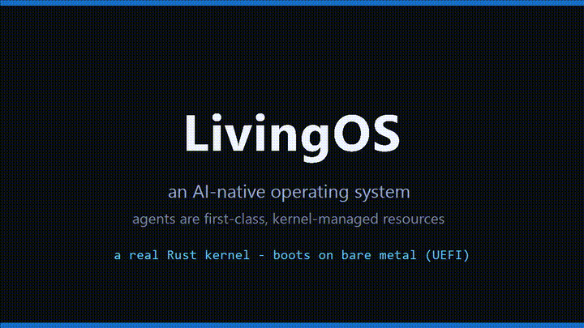
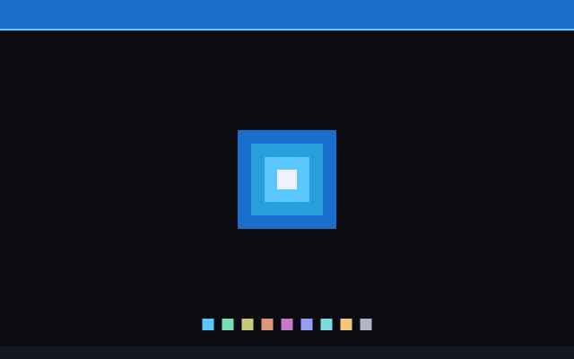
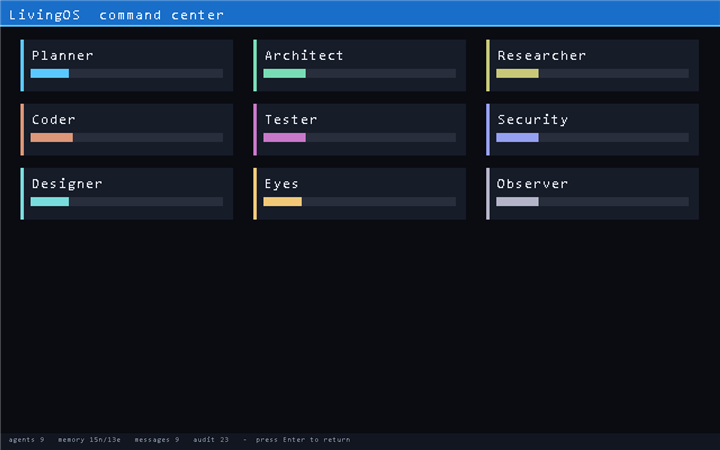
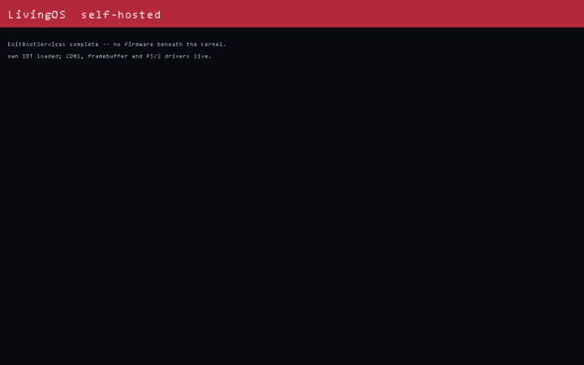

# LivingOS

**An AI-native operating system where intelligent agents are first-class,
kernel-managed resources** — alongside processes, threads, memory, and files.

Traditional operating systems are built around applications. LivingOS is built
around agents. You don't open apps; you express **goals**, and an agent society
assembles to accomplish them. The kernel understands agent **identity,
capabilities, lifecycle, scheduling, and IPC as native primitives** — not as an
application-level convention. The large language models that make agents
intelligent stay in user space (safer); the kernel owns the agents themselves.

This is an experimental OS. It boots on bare-metal UEFI firmware — in a VM or on
real hardware.

```
 User  →  Goal  →  Agent Society  →  Living Kernel  →  Hardware
```

**[▶ Watch the demo](docs/livingos_demo.mp4)** · **[Install / boot it](docs/INSTALL.md)** · **[Roadmap (GUI + self-hosted desktop)](docs/ROADMAP.md)** · **[Status](docs/STATUS.md)**





*The boot splash above is a real GPU-framebuffer render captured from LivingOS
running in QEMU (1280×800): the title band, the nested-square "living core",
and nine indicators for the agent society.*

## Two layers

### 1. The Living Kernel — `kernel/`  (the operating system)
A `no_std`, bootable **UEFI** Rust kernel. `kernel/src/main.rs` is the OS image:
UEFI firmware loads `livingos.efi` and jumps straight into the kernel. At boot it
brings up its **native agent subsystem** and demonstrates the core machinery:

- agents as kernel objects (Agent Control Blocks) with scoped **capabilities**
- a **priority scheduler** over agents (the Native Agent Scheduler)
- a **capability gate** every privileged action must pass — granted *or denied*
- a transparent **audit trail** (every action is explainable)
- **reputation** that moves with outcomes (the Evolution Engine signal)
- a **GPU framebuffer** splash via the UEFI Graphics Output Protocol
- an **interactive Living Shell** (keyboard *or* serial) — you state goals at boot
- an on-device **planner** that decomposes a goal into role-assigned tasks
- **Living Memory** as an in-kernel graph, **persisted to the EFI partition**
  across reboots

```sh
cd kernel
cargo build --release            # produces target/x86_64-unknown-uefi/release/livingos.efi
./run.ps1        # Windows: build + boot in QEMU (UEFI/OVMF)
./run.sh         # Linux/macOS: same
```

LivingOS boots into an interactive prompt. You don't open apps — you state goals:

```
living> ps                 # the agent society: roles, state, reputation, capabilities
living> goal build a secure multiplayer game with cover art
[plan] 6 tasks; dispatching by priority...
  [Security  ] review the security model      <- "secure" routed Security first
  [Architect ] design the approach
  [Researcher] research the problem and constraints
  [Coder     ] implement the core
  [Tester    ] validate it works
  [Designer  ] generate the visual asset       <- "art" pulled in the Designer
[done] ... handled by 6 agents.
[mem] Living Memory persisted to disk.
living> mem                # browse Living Memory (survives reboots)
living> log                # the transparent audit trail
living> shutdown
```

Every step is capability-gated and written to the audit trail; the capability
gate grants `screen_capture` to **Eyes** while **denying** it to **Coder**.

The `dash` command renders the **visual command center** to the GPU framebuffer
— the agent society as live cards with reputation bars (own bitmap-font text):



### 2. The user-space runtime — `crates/`  (the intelligence)
The agents' minds. In a full hardware build these run as a user-space system
service the kernel schedules; today they run on a host so you can drive the
society against **local models** right now.

| crate | role |
|---|---|
| `los-kernel` | host-side mirror of the agent/capability/scheduler model |
| `los-memory` | **Living Memory** — a persistent graph of goals, knowledge, observations |
| `los-router` | **Intelligence Router** — maps each agent role to a small local model (Ollama) + a local image server |
| `los-perception` | the **Eyes** — captures the desktop for the vision model |
| `los-runtime` | the **Agent Society** and the `goal` / `see` / `design` verbs |
| `los-shell` | `living` — the Living Shell (CLI) |

```sh
cargo build --release
./target/release/living init      # write config/ and data/
./target/release/living doctor    # check Ollama + pull missing models
./target/release/living ps        # see the society
./target/release/living goal   "build a snake game in python"
./target/release/living see    "what's on my screen right now?"
./target/release/living design "a neon koi fish in dark water, cinematic"
```

## The local model fleet (newest small specialists, mid-2026)
All local. No cloud. Edit `config/fleet.json` — the router is model-agnostic.

| role | model |
|---|---|
| conversation | `smollm3:3b` |
| planning | `gemma4:4b` |
| coding / tools | `qwen3.5:4b` |
| vision (Eyes) | `qwen3-vl:2b` |
| ocr | `glm-ocr:0.9b` |
| embedding | `embeddinggemma` |
| stt / tts | `moonshine` / `kokoro` |
| image (Designer) | **Z-Image Turbo** / **FLUX.2 Klein** (local SD server) |

## Build requirements
- Rust (stable) with the UEFI target: `rustup target add x86_64-unknown-uefi`
- QEMU + OVMF firmware (to boot the kernel)
- Ollama (for the user-space model fleet); a local Stable-Diffusion server for image gen

## Status & roadmap
**Milestone 1 (done):** bootable UEFI kernel with the native agent subsystem;
host-side Agent Runtime, Intelligence Router, Living Memory, the Eyes perception
agent, the Designer image agent, and the Living Shell — all building and tested.

**Milestone 2 (done):** the kernel is now *interactive and persistent*. An
on-OS Living Shell (keyboard or serial), an on-device planner, an in-kernel
Living Memory graph **persisted across reboots** (real FAT image), and a GPU
framebuffer boot splash + **visual command center** (`dash`).

**Milestone 3 (done):** real low-level systems, each verified booting in QEMU —
a **syscall bridge** (`int 0x80` into the kernel's own IDT), **paging** (frame
allocator + live page-table mapping), **on-metal neural-net inference** (a tiny
char model running in the kernel), **PC-speaker audio**, a **plugin system**
(agents from an ESP manifest), **NIC access + ARP** via the UEFI SNP, and a
**context-switch primitive**. See the `syscall`, `vm`, `gen`, `beep`, `plugins`,
`net`, `tasks` shell commands.

**Milestone 4 (done):** the kernel↔user-space **model bridge** (COM2 → a host
model service → local models; `ask`), a hand-rolled **IPv4/ICMP stack** that
transmits verified ping frames (`ping`), **voice I/O** (on-metal PC-speaker TTS
`say` + bridge STT `hear`), and **self-hosting** — `selfhost` calls
`ExitBootServices` and runs LivingOS on its own IDT, serial, framebuffer, and
PS/2 drivers with no firmware beneath it:



See [docs/STATUS.md](docs/STATUS.md) for a candid, detailed account of exactly
what works today, with honest caveats, and the remaining roadmap.

## License
MIT — see [LICENSE](LICENSE).
